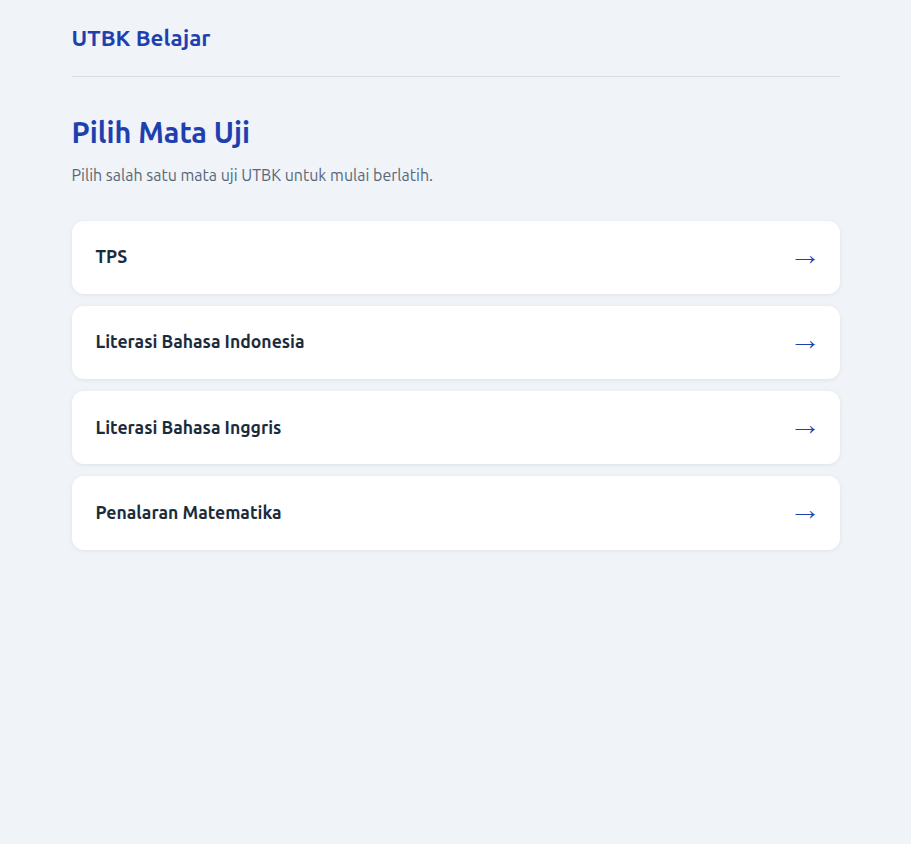
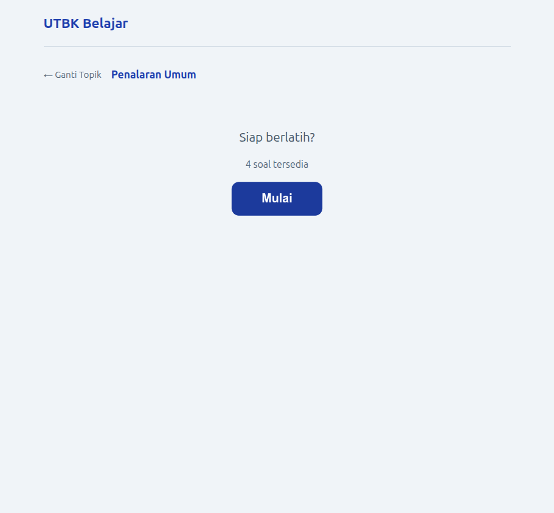
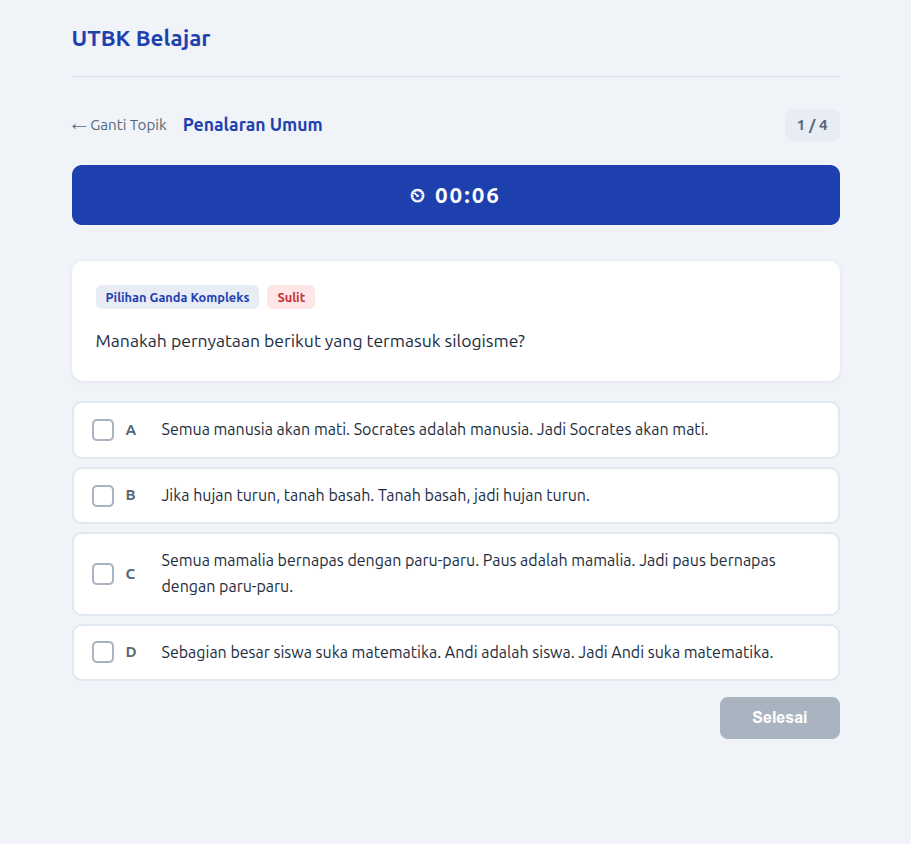
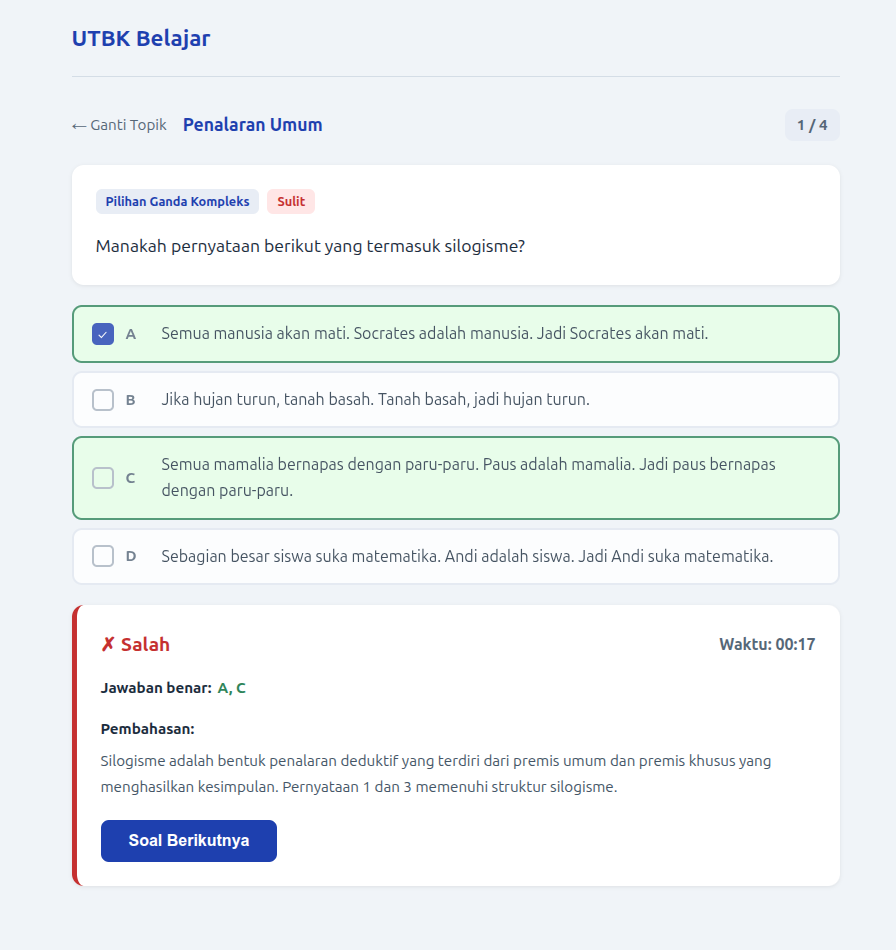

# UTBK Belajar

Aplikasi web sederhana untuk belajar soal UTBK.

| | |
|---|---|
|  |  |
|  |  |

Flow: pilih topik → kerjakan soal acak → timer → jawab → lihat pembahasan → lanjut → resume.

- **Stack:** Bun + Hono + Drizzle + MariaDB + Vue 3
- **Auth opsional:** via `APP_PASSWORD` di `.env`
- **Testing:** 51 test (Vitest)

---

## Cara Menjalankan

### Prasyarat

- [Bun](https://bun.sh) v1.3+
- MariaDB / MySQL 8, database `utbk_belajar` sudah dibuat

### Setup

```bash
git clone <repo> utbk2 && cd utbk2
bun install && bun run install:all
bun run db:migrate && bun run seed
bun run dev
```

Frontend di `http://localhost:5173`, backend di `http://localhost:3000`.

### Konfigurasi `.env`

```env
DB_HOST=127.0.0.1
DB_PORT=3306
DB_USER=root
DB_PASSWORD=password-anda
DB_NAME=utbk_belajar
APP_PORT=3000
FRONTEND_PORT=5173
APP_PASSWORD=        # kosong = tanpa login, isi = login required
CORS_ORIGIN=         # kosong = auto localhost, isi domain untuk production
```

---

## Perintah Penting

| Perintah | Fungsi |
|---|---|
| `bun run dev` | Jalankan backend + frontend |
| `bun run test` | Semua test |
| `bun run typecheck` | TypeScript check |
| `bun run seed` | Insert soal dari `seed.json` |
| `bun run seed:check` | Validasi `seed.json` tanpa DB |
| `bun run db:migrate` | Migrasi database |
| `bun run lint` / `format` | ESLint / Prettier |

---

## Dokumentasi

| Topik | Lokasi |
|---|---|
| Arsitektur & API | `docs/ARSITEKTUR.md` |
| Panduan deploy production | `docs/DEPLOY/` |
| Format & cara menambah soal | `docs/FORMAT-SOAL/` |
| Struktur direktori | `docs/STRUKTUR.md` |
| Catatan rilis | `docs/CHANGELOG.md` |
| Aturan project untuk developer | `RULES.md` |

---

## FAQ

**Q: Apakah aplikasi selalu pakai login?**  
A: Tidak. Hanya jika `APP_PASSWORD` diisi di `.env`.

**Q: Kenapa tidak ada riwayat nilai?**  
A: Scope aplikasi latihan per soal tanpa history tersimpan.

**Q: Bisakah menambah soal lewat UI?**  
A: Tidak. Soal masuk lewat `seed.json` → `bun run seed`. Lihat `docs/FORMAT-SOAL/`.

**Q: Timer countdown atau stopwatch?**  
A: Stopwatch per soal, bukan countdown.

---

Private — untuk penggunaan pribadi.
